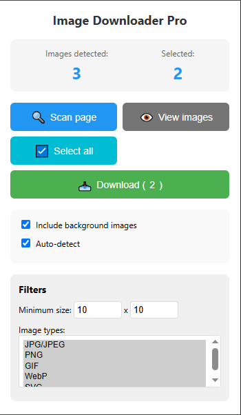

# Image Downloader Pro

A powerful Chrome extension that allows you to easily find, preview, and download images from any webpage with advanced filtering options.

## Features

- 🖼️ Scan and display all images on the current webpage
- 🔍 Filter images by size and type (JPG, PNG, GIF, WebP, SVG)
- 📥 Download selected images with one click
- 🖱️ Preview images before downloading
- 🎯 Smart selection tools (select all/deselect all)
- 🔄 Auto-detect new images as you browse
- 🖌️ Support for both regular and background images

## Installation

1. Clone this repository or download the source code
2. Open Chrome and navigate to `chrome://extensions/`
3. Enable "Developer mode" (toggle in the top-right corner)
4. Click "Load unpacked" and select the extension directory

## Usage

1. Click the extension icon in your browser toolbar
2. Click "Scan page" to find all images on the current page
3. Use the filters to narrow down the results:
   - Set minimum width and height
   - Select specific image types
4. Select images by clicking on them
5. Click "Download" to save selected images

## Options

- **Include background images**: Toggle to include CSS background images in the scan
- **Auto-detect**: Automatically scan for images when opening the popup
- **Minimum size**: Filter out small images by setting minimum width and height
- **Image types**: Select which file types to include in the scan

## Contributing

Contributions are welcome! Please feel free to submit a Pull Request.

1. Fork the repository
2. Create your feature branch (`git checkout -b feature/AmazingFeature`)
3. Commit your changes (`git commit -m 'Add some AmazingFeature'`)
4. Push to the branch (`git push origin feature/AmazingFeature`)
5. Open a Pull Request

## License

Distributed under the MIT License. See `LICENSE` for more information.

## Contact

Rabenandrasana Yeliel Gerard - [@YelielGerardK](https://twitter.com/YelielGerardK)

Project Link: [https://github.com/YelielGerardK/image-downloader-pro-extension](https://github.com/YelielGerardK/image-downloader-pro-extension)

## Acknowledgements

- [Choose an Open Source License](https://choosealicense.com)
- [Chrome Extensions Documentation](https://developer.chrome.com/docs/extensions/)
- [Best README Template](https://github.com/othneildrew/Best-README-Template)
